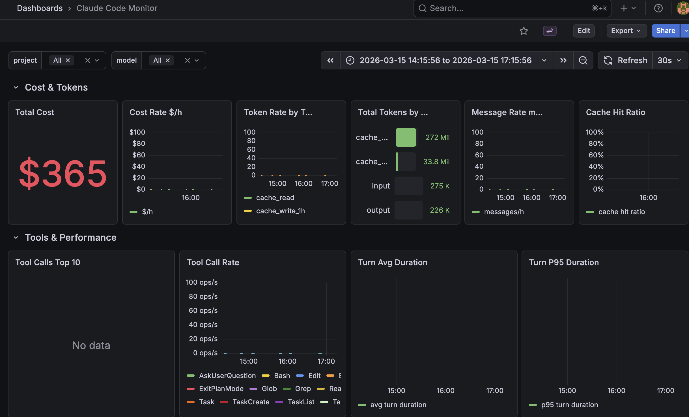
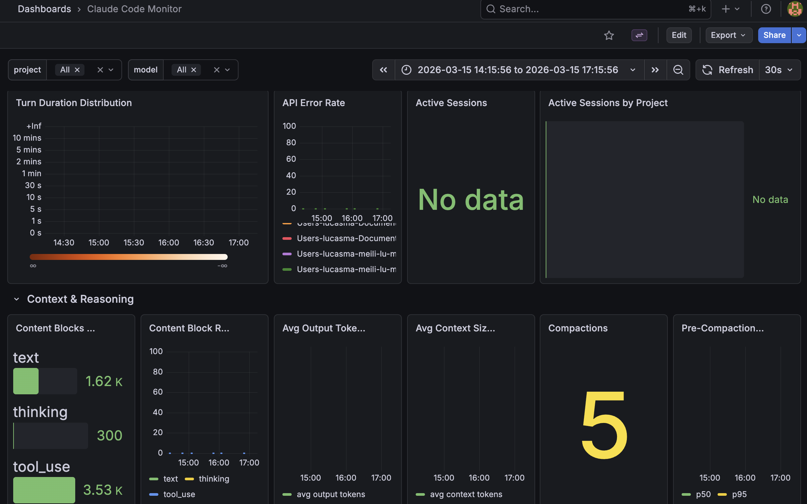
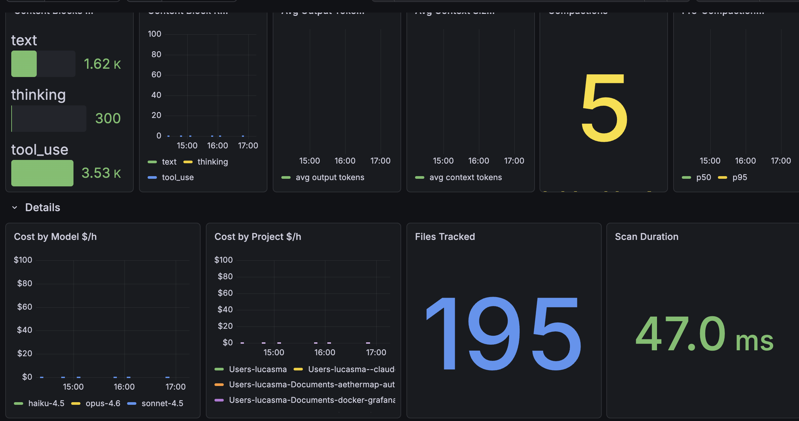

# Claude Monitor

[English](README_EN.md)

> 一条命令，让你对 Claude Code 的每一分钱、每一个 token 了如指掌。

Claude Monitor 是一个轻量级的 Claude Code 实时监控工具。它自动解析本地 JSONL 日志，通过 Prometheus + Grafana 构建可视化仪表板，帮助你追踪 token 消耗、API 成本、工具调用频率、上下文窗口大小等关键指标。







## 功能特性

- **成本追踪** — 按模型（Opus / Sonnet / Haiku）实时计算 USD 花费，包括缓存读写细分
- **Token 分析** — input / output / cache_read / cache_write 全维度统计
- **工具调用监控** — Top 10 工具排名、调用频率趋势
- **性能指标** — Turn 平均/P95 耗时、API 错误率、上下文压缩事件
- **多项目支持** — 按项目维度筛选，一览所有 Claude Code 工作区
- **一键启停** — `ccmon` 命令自动拉起 Prometheus + Grafana + Exporter

## 前置要求

- Python 3.10+
- Docker & Docker Compose
- Claude Code（会生成 `~/.claude/projects/` 下的 JSONL 日志）

## 安装

```bash
# 下载发布包
tar xzf claude-monitor-1.0.0.tar.gz
cd claude-monitor-1.0.0

# 一键安装
./install.sh
```

安装脚本会将文件复制到 `~/.claude-monitor`，创建 Python 虚拟环境，并在 `~/.local/bin` 下创建 `ccmon` 命令。

## 使用

```bash
# 启动监控
ccmon

# 启动监控并同时打开 Claude Code
ccmon -c

# 停止所有服务
ccmon stop
```

启动后自动打开 Grafana 仪表板：`http://localhost:3000`

## 架构

```
~/.claude/projects/**/*.jsonl
        │
        ▼
  claude_exporter.py (:9091/metrics)
        │
        ▼
    Prometheus (:9090)
        │
        ▼
    Grafana (:3000)
```
